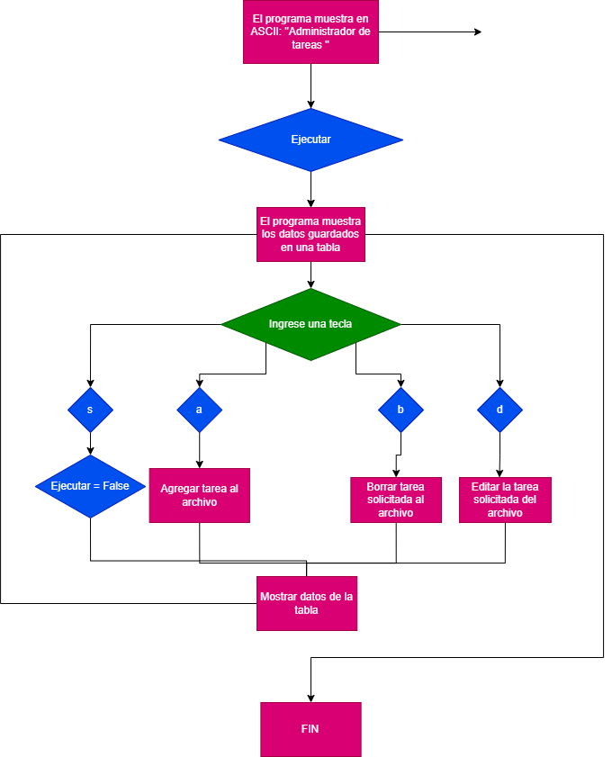

## ✅ Proyecto: Administrador de tareas
Las personas nos vemos rodeadas por cientos de tareas que surgen cada día, pues no solamente los estudiantes se ven en la necesidad de llevar un registros de sus pendientes. En todo momento nos encontramos de decenas de cosas que ocupan tiempo y esfuerzo en ciertas fracciones del día, que, en muchos casos, están planeadas para mejorarnos como personas o para ayudar a otros.
En este momento es cuando cobran importancia las agendas, ya que a veces no es fácil recordar todos nuestros quehaceres durante el día. Además de tener la clara utilidad de recordatorio, llevar un registro de todas estas ocupaciones contribuye a que podamos organizar nuestros días o semanas de forma eficiente y ordenada, asignar tiempo específico a ciertas tareas, controlar y analizar nuestras acciones y nos ayuda a visualizar y cumplir nuestras metas. Finalmente con todo ello, nos hace sentir más relajados.
Ahora, realizar este proyecto mediante una consola de Python es un desafío, pero el planteamiento es guardar los datos ingresados por el usuario en un archivo de texto, pero dejando abierta la posibilidad a conectar con una base de datos de servicios como MySQL.

## 🛠️ Instalación de librerías utilizadas

### PrettyTable
    pip install prettytable
    
Es una librería que permite mostrar información de forma ordenada y con un atractivo diseño en código ACII. En este programa se utiliza para mostrar las tareas inscritas dentro de un archivo xlsx.
### Openpyxl

    pip install openpyxl

Una librería para trabajar con Excel desde Python, similar a la famosa Pandas, que permite leer, modificar y guardar datos en ese formato.
### Matplotlib

    pip install matplotlib

Matplotlib es la librería de Python para realizar gráficas de funciones matemáticas. En este programa se utiliza para mostrar una gráfica de pastel del porcentaje de tareas completadas y no completadas.
## 🧾 Algoritmo
#### Inicio del programa
La consola debe mostrar al inicio un mensaje anunciando el programa "**Administrador de tareas**", para posteriormente mostrar una tabla con todas las tareas que se han registrado por el usuario. Aparecerá un texto con las leyendas: "a: agregar | b:borrar | d: editar | e: "Mostrar estadistica" | s: salir" . Dependiendo de la selección del usuario, que deberá ingresar un carácter mediante la consola, se realizará la acción marcada por el valor ingresado. 
Las variables son:

 1. Descripción de la tarea **(String)**: El usuario ingresa qué tarea debe completar en un texto.
 2.  Fecha de límite para completar la tarea, que si bien es parte de la clase **datetime**, el usuario deberá ingresar los siguientes valores de tipo **int**:
	 - Día límite
	 - Mes límite
	 - Año límite
	3. Diferencia de días entre ambas tareas **(int)**
	4. Objeto traído de la clase PrettyTable, que nos permita mostrar tablas para ordenar los datos de forma gráfica en la consola 
	5. Id, que el programa usara trabajará como un iterador **(int)**
	6. Elección del usuario, será del tipo **char**, podrá tomar los valores de 'a', 'b', 'd', 'e' o 's'. Nos servirá para controlar las acciones del programa.
	 
#### Procedimientos
Si presiona "a", le pedirá que ingrese la descripción de la tarea y la fecha límite. El programa por su cuenta guardará la fecha en que fue creada la tarea y le asignará un identificador numérico. Con la fecha límite, el programa mostrará los días restantes que el usuario tiene para completar la tarea.
Si presiona la letra b, le pedirá el identificador númerico de la tarea, que eliminará de donde sea que estemos guardando la información.
Si presiona d, le pedirá que ingrese el número de tarea, para 
posteriormente solicitar nuevamente los valores del apartado creación de tarea, pero esta vez los reemplazará en la tarea identificada con el número que ingresó el usuario.
#### Final del programa
Cuando se ingrese cualquiera de los carácteres anteriores, el programa mostrará la tabla actualizada, y le regresará el mensaje indicando que hace cada tecla ingresada. 
Sin embargo, si el usuario presiona la tecla "s", el programa le dará un pequeño mensaje agradeciendo el uso del mismo y termina la ejecución.

